This is a dashboard made with `Flexdboard` using `r programming`. in this dashboard i have 
tried to get the insights of the election result and the participation of different section 
of society, like what is the participation of females? What are their winning percentages?
How many parties are participating in the election? What is the performance of theirs? What 
is the age distribution of candidates partywise and in general? what is the age distribution 
of winning candidates? Is there any geographic stronghood of any parties? etc. 

# Quick Tech Description

- The interectivee map is made with package `tmap`
- `tmap` is very handy for making thematic maps in `r`
- The static map plot is made with `sf` package combined with `ggplot2`
- dashboard is based on `Flexdashboard` package
- `Flexdashboard` could be more customised to give stunning dashboards.
- Plot's skeleton is based on `ggplot2` : very powerful visulization making library in `R`
- Plot's interectivity is based on `plotly` package
- `DT` package is used to render interective tables
- `knitr` package, `kable` function is used to render the static table
- `dplyr` package is used frequentally to clean and manipulate yhe dataset.

# Important File Description
* **Shape file** :- Contains the shape file of Indian assembly constituency.
* **code.Rmd** :- Contains the Rmd file of R source Code
* **code.html** :- Contains the HTML file of the dashboard
* **data/src** :- Contains the Bihar assembly election result 2020 data
* **Images** :- Contains screenshot and images of data visulization
* **renv & renv.lock** :- Is created by `renv` package to preserve and reproduce the environment

# Data Source
## Website
[https://eci.gov.in/](https://eci.gov.in/)

## Data Download Link
[Dataset excel format](https://eci.gov.in/files/file/12787-bihar-legislative-election-2020/?do=download&r=38109&confirm=1&t=1&csrfKey=78950e195a087a581e398c4f14b9f83c)

# Snapes of plots and maps

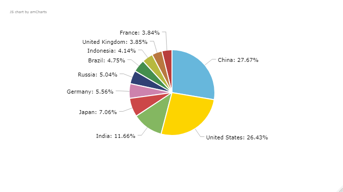

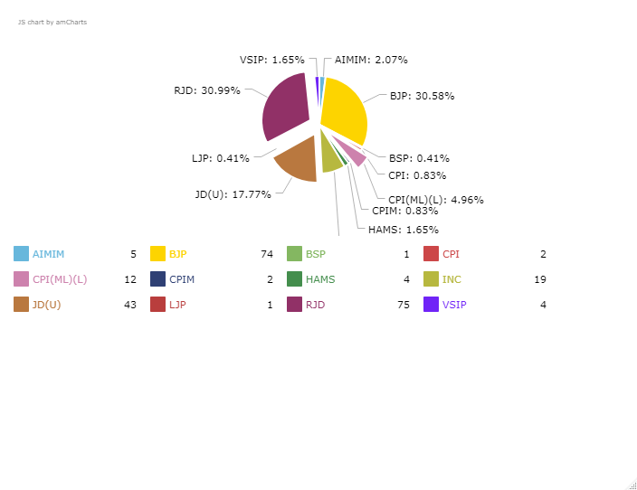

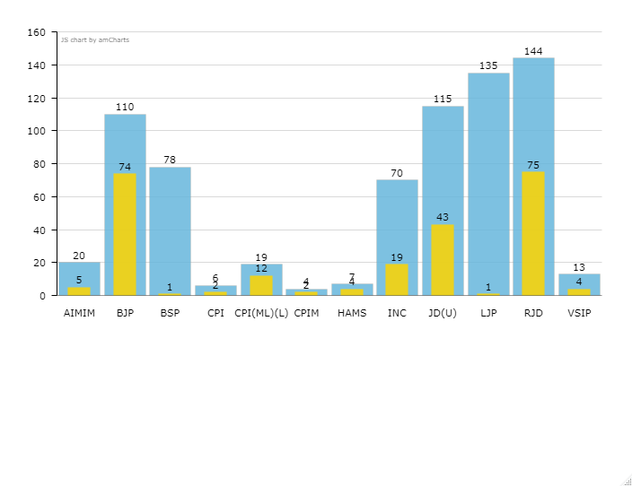

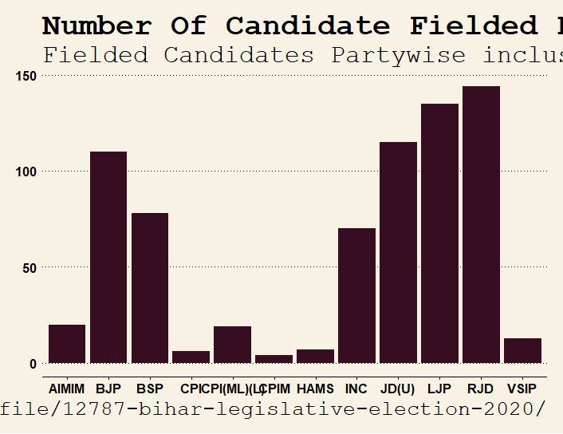

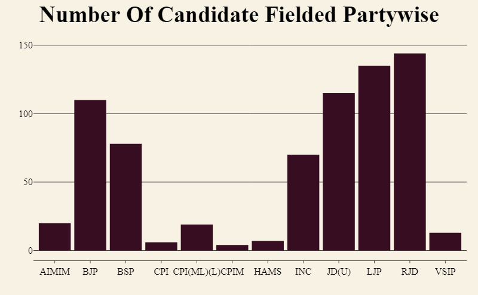

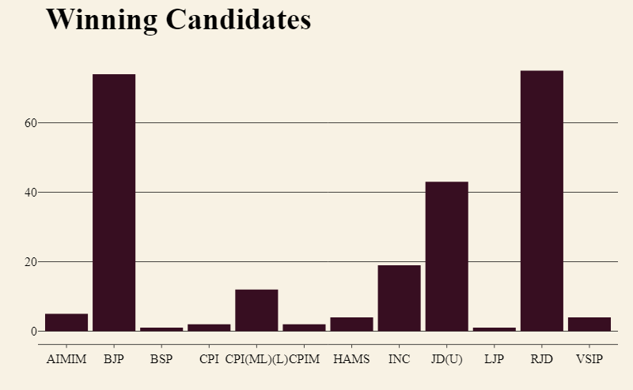

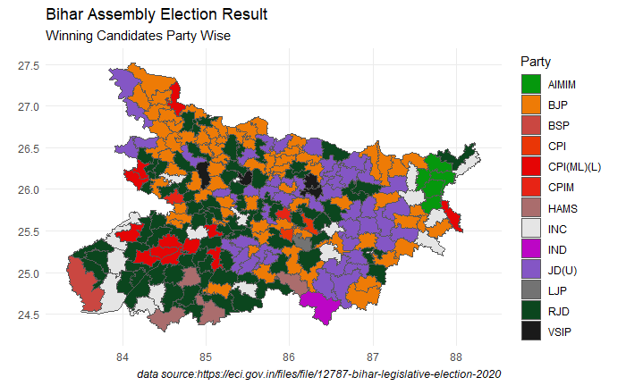

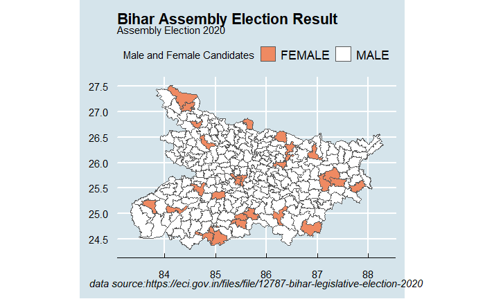

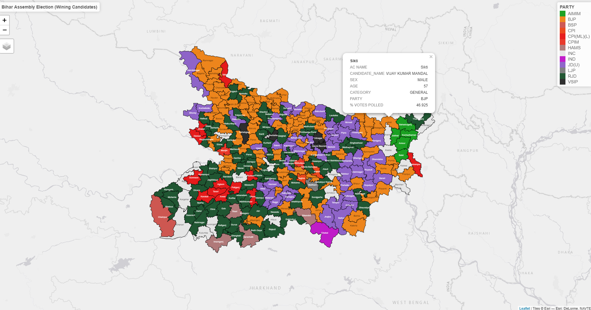

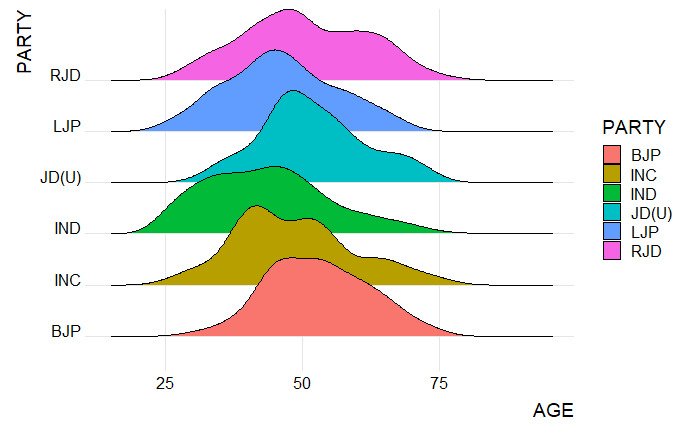

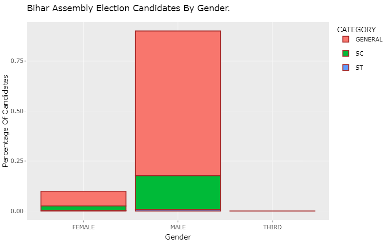

# Environment (it is also specified in renv files)
I have made this project with following environment:-

**`RStudio Version 1.4.1717`**

**`R 4.1.1`**
