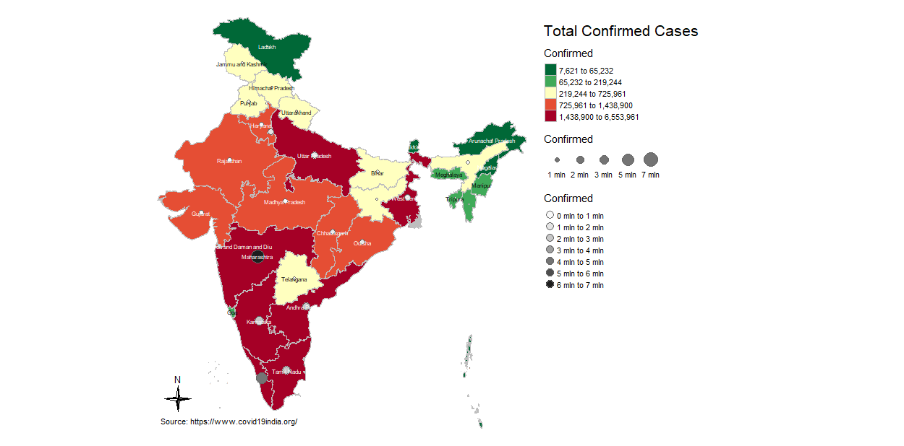

#### When you visit the live project link, you will see the following maps:-

I have made a statc and a interective map of India to visualize COVID-19 confirmed cases in India state wise as of 1st october 2021.

#### R programming packages used for making map:-
- Map made with package `tmap`
- `tmap` is very handy for making thematic maps in `r`

#### When you open the github repository link or the Rstudio cloud link, you will see the following files:-
* **India_State_Shapefile** :- Contains the shape file of India.
* **Code rmarkdown** :- Contains the Rmd file of R Code
* **Code-rmarkdown** :- Contains the HTML file of Maps
* **states** :- Contains the COVID-19 India data
* **Images** :- Contains screenshot of maps

#### Data was obtained from the following websites:-
##### Website
[https://www.covid19india.org/](https://www.covid19india.org/)

##### Data Download Link
[https://data.covid19india.org/csv/latest/states.csv](https://data.covid19india.org/csv/latest/states.csv)

#### Environment
I have made this project with following environment:-

**`RStudio Version 1.4.1717`**

**`R 4.1.1`**

